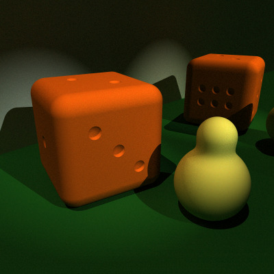
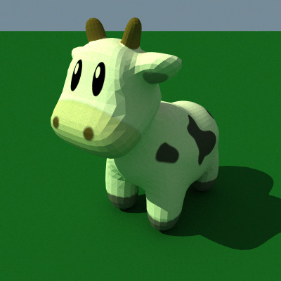

# A Toy Pathtracer

This project is born from my curiosity about what pathtracing and
raymarching are and how they differ from raytracing (or rather the
little I knew of raytracing 30 years ago). It was also an opportunity
to experiment with Monte-Carlo methods and to hone my rusted skills
when it comes to calculus (damn density functions).

It has been heavily influenced by the book [Physically Based
Rendering: From Theory To Implementation](https://pbr-book.org/) by
Matt Pharr, Wenzel Jakob, and Greg Humphreys, which I heartily
recommend. Despite its seemingly narrow subject, this book covers a
wide variety of topics, from physic models to algorithmic concerns,
from mathematics to implementation details.

In particular, without this book, I would never have fully understood
the following points:

- Handling specular rays does not have to be a hack. They neatly fit
  into a Monte-Carlo framework, despite their Dirac distributions, as
  long as importance sampling is used.

- Sampling both the material bsdf and the light sources along a path
  is a mathematically-grounded way to perform illumination, thanks to
  multiple importance sampling.

- Sampling the whole visible spectrum rather than just three color
  channels does not make things much harder or slower. Moreover, it
  makes sense to process multiple, equally spaced wavelengths along a
  single path.

- Metallic reflection is just refraction with a complex, varying index
  of refraction.

As for raymarching and signed distance functions, a great reference
was [Inigo Quilez's
website](https://iquilezles.org/articles/distfunctions/), which is a
treasure trove of ideas.

Note: A slightly modern C++ compiler is needed, as the code relies on
several C++20 features.

To generate a `foo.ppm` file from a scene description (e.g.,
`examples/spheres.hpp`), execute the following command.

```shell
make -f Remakefile examples/spheres && examples/spheres
```

Supported features:

- Pathtracing by sampling both lights and materials.

- Raymarching using signed distance functions.

- Triangulated meshes using the `.obj` format with textures using the `.ppm` format.

- Spectral distributions.

Caveats:

- Signed distance functions are only meaningful outside primitives, so
  they should not be used with a transparent material.

- There is neither path regularization nor bidirectional illumination,
  so diffuse surfaces indirectly illuminated by reflective or
  refractive materials will look very noisy.

- Texture colors are poorly approximated by spectral distributions.

- Too many caveats to list exhaustively.

Disclaimer: Most samplers are naive, rejection-based ones, and should
not serve as examples. Also, the monolithic structure of the code is
not a good practice either.





